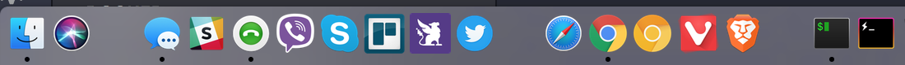
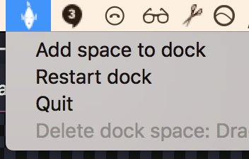

# macOS-dock-spaces

macOS app for adding spaces to your dock. Spacers help keep your dock organized. The app only needs to run when you need to add spacers.



## Install pre-built app

1. Download [Dock-Spaces-1.1.dmg](https://github.com/saada/Dock-Spaces/raw/master/Dock-Spaces-1.1.dmg)
2. Run the file, then drag&drop to Applications folder
3. Run `Dock Spaces.app` from your Applications folder and find the commands in the top status bar icon 
4. After adding a few spaces to dock, you will be able to move the spaces around the dock to wherever you like. NOTE: you can also throw spaces out of the dock just like you would remove a regular app
5. You can shut down the app after adding all the spacers you need

## Features

- works on macOS 10 and 11
- only run when adding spacers
- dark mode support
- different sized spacers


## Make your own build

After running `git clone`, compile with

```sh
xcodebuild clean build CODE_SIGN_IDENTITY="" CODE_SIGNING_REQUIRED=NO
```

Use [create-dmg](https://github.com/sindresorhus/create-dmg) tool to generate dmg file.

```sh
create-dmg build/Release/Dock\ Spaces.app
# generates ./Dock-Spaces-1.0.dmg
```
